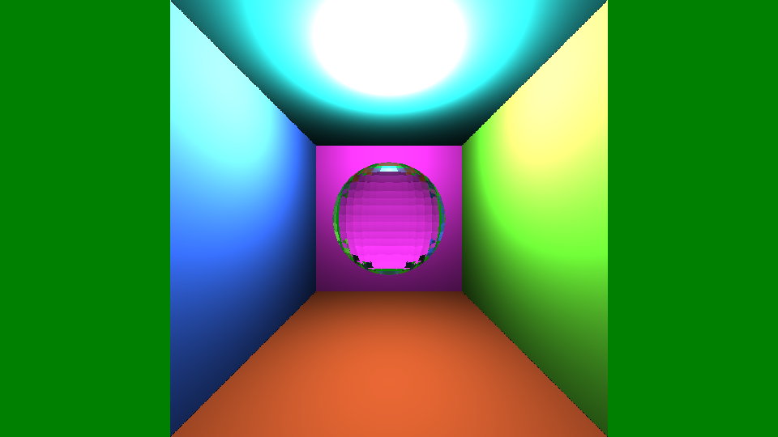

# RayTracer

A simple CPU-based ray tracer written in **C++**, developed as a learning project to explore the fundamentals of ray tracing and physically based rendering.

---

## 📸 Gallery (Rendered Results)

> *The images and videos below are generated entirely by this ray tracer.*

### 🖼️ Images

*Example render showcasing basic geometry and lighting.*

*Example render showcasing basic geometry and lighting.*

*Example render showcasing basic geometry and lighting.*

*Example render showcasing basic geometry and lighting.*

### 🎥 Videos

