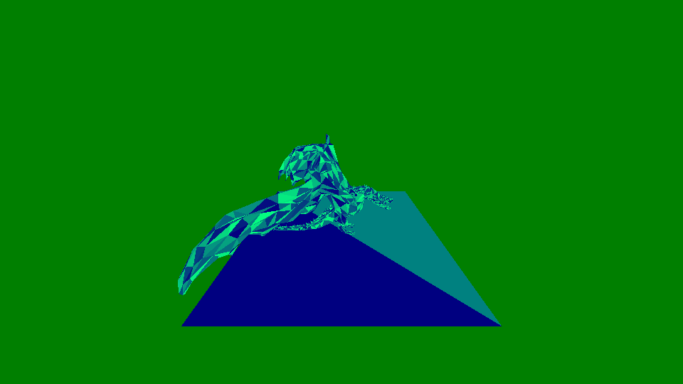
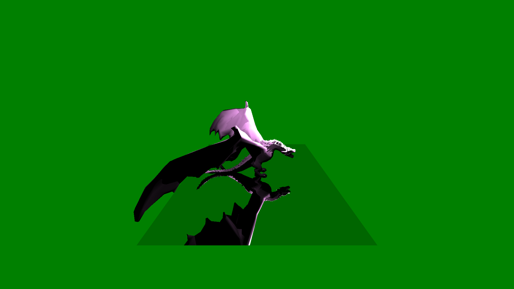
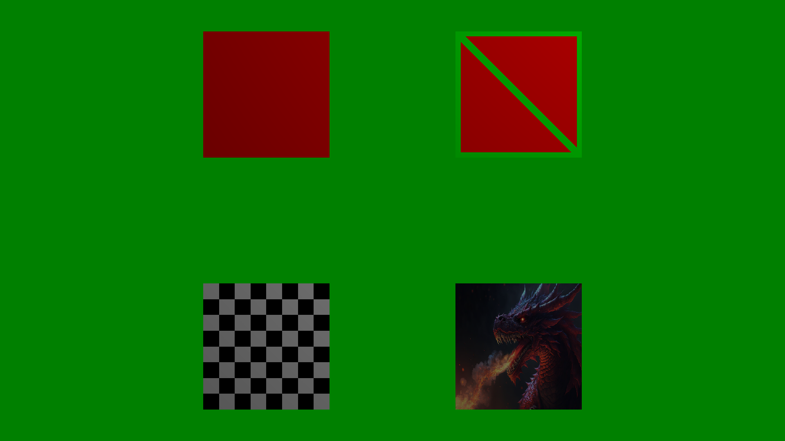
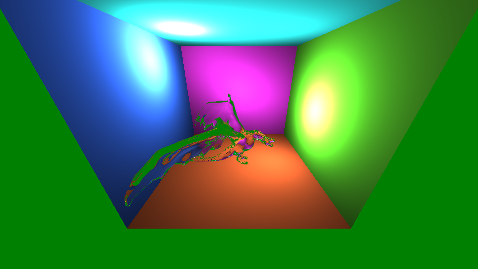
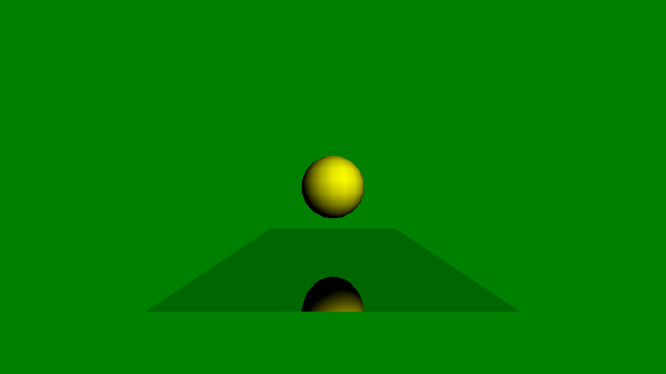

# RayTracer

A simple CPU-based ray tracer written in **C++**, developed as a learning project to explore the fundamentals of ray tracing and physically based rendering.

## ⚙️ Features

- ✅ CPU-based ray tracing
- ✅ Perspective camera
- ✅ Ray–triangle intersection
- ✅ Basic lighting and shading
- ✅ Shadows
- ✅ Reflections
- ✅ Scene loading
---

## 📸 Gallery (Rendered Results)

> *The images and videos below are generated entirely by this ray tracer.*

### 🖼️ Images

*Example render showcasing triangle intersection.*

*Example render showcasing 3D model rendering, light, shadows and reflections.*

*Example render showcasing refraction.*

*Example render showcasing textures.*

*Example render showcasing more complex scenes with refraction and reflection.*

### 🎥 Videos

